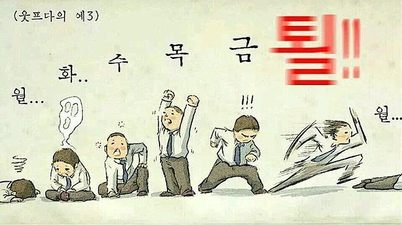

# 두 번째 회고

저번주에 첫 번째 회고를 쓰고난 후 벌써 또 한 주가 지났다.. 시간 참 빠른것같다. 평일에는 수업듣고 저녁먹고 좀 쉬다가 공부도 하고 정리도 하고 가끔 운동도 하다보면 진짜 하루가 언제 지나갔는지도 모르게 순식간에 지나간다.. 주말에는 아르바이트도 하면서 여자친구랑 데이트도 하느라 한 주가 어떻게 지나갔는지도 모르겠다..

이번주에는 중간에 휴강이 있었는데 너무 좋았다. 잠도 느긋하게 늦잠자고 부족했던 공부도 하고 공부했던 내용을 정리도 하면서 보냈다. 앞으로도 꾸준히 휴강도 중간에 한번씩 있었으면 좋겠다..ㅋㅋㅋㅋ

 

## 키워드

### `HTML`

수업을 들으면서 내가 알고 있던 태그들도 있지만 몰랐던 태그들도 꽤 있었다. 내가 사용해왔던 마크업은 태그의 기본기만 알고 있어도 사용할 수 있는 수준이였구나라는 것도 느꼈다.. 다양한 태그들과 태그의 다양한 속성들을 통해서 다양하게 사용할 수 있는 방법을 배울 수 있는 좋은 기회였다. 강사님 말대로 HTML은 깊이있게 들어가면 내용도 많고 어려운것 같다..

**관련 직종에서 일하면서 내가 공부를 안했던 부분도 굉장히 반성이 된다..**

### `CSS`

CSS는 역시 재미있다.. 나는 CSS로 구조를 스타일링하는 어느 한 유튜브 영상을 처음 접하고 나서 웹퍼블리셔의 길을 가게 되었다. 하지만 CSS도 마찬가지로 단순히 외워서만 사용해서 그런가.. 왜 이렇게 사용되는지 자세히 배울 수 있는 시간이여서 좋았다.

**물론 강사님 강의 퀄리티가 좋은것도 있고 재미있게 알려주셔서 너무 좋다⭐**

 

## 앞으로의 할일

생각나는대로 추가해서 실천해보기❗

1. 블로그 시작해보기
   - 이론적으로 배웠던 내용들을 실습해서 게시

2. 마크다운을 이용한 이론정리
   - 수업에서 배웠던 내용과 강의 자료를 통해 이론정리

3. 다이어트...
   - 블로그에 다이어트 카테고리 하나 추가해서 시작해보기...
